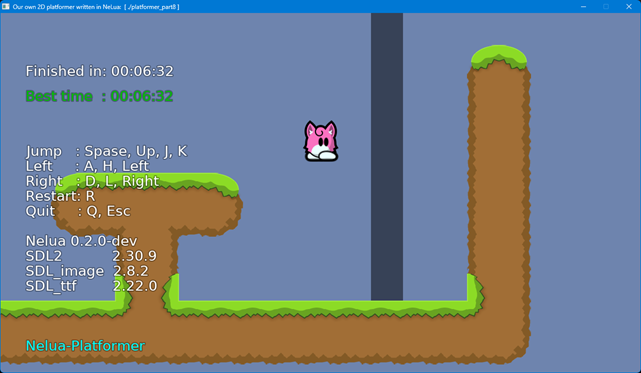

<!-- START doctoc generated TOC please keep comment here to allow auto update -->
<!-- DON'T EDIT THIS SECTION, INSTEAD RE-RUN doctoc TO UPDATE -->

- [NeLua-Platformer](#nelua-platformer)
  - [Support OS](#support-os)
  - [Prerequisites](#prerequisites)
  - [Run tutorials](#run-tutorials)
  - [Key operation](#key-operation)
  - [Tutorial sources](#tutorial-sources)
  - [SDL2 headers for Nelua](#sdl2-headers-for-nelua)
  - [Tools version](#tools-version)
  - [Reference](#reference)

<!-- END doctoc generated TOC please keep comment here to allow auto update -->

### NeLua-Platformer

---

Writing a 2D Platform Game in [NeLua language](https://github.com/edubart/nelua-lang) with SDL2.

This repository has been inherited from
[Nim-Platformer](https://github.com/def-/nim-platformer) and [LuaJIT-Platformer](https://github.com/dinau/luajit-platformer) project.
   - Document  
   English:  https://hookrace.net/blog/writing-a-2d-platform-game-in-nim-with-sdl2/  
   Japanese: https://postd.cc/writing-a-2d-platform-game-in-nim-with-sdl2/  

Skin database [https://ddnet.org/skins](https://ddnet.org/skins)



#### Support OS

---

Windows10 or later


#### Prerequisites

---

1. Install [MSys2/MinGW](https://www.msys2.org/) 
1. Install [NeLua](https://nelua.io/installing/)
1. Install SDL2 libraries

   ```sh
   pacman -S mingw-w64-x86_64-{SDL2,SDL2_image,SDL2_ttf}
   ```

   or if you use `ucrt` libraries,

   ```sh
   pacman -S mingw-w64-ucrt-x86_64-{SDL2,SDL2_image,SDL2_ttf}
   ```

- Other tools

   ```sh
   pacman -S make
   ```

   Git command installed

#### Run tutorials

---

1. Clone from git

   ```sh
   git clone  https://github.com/dinau/nelua-platformer
   ```

1. Build and run

   ```sh
   cd nelua-paltformer
   cd tutorial
   make 8r      # Build and run platformer_part8.nelua
   ```

   or  enable runtime checking and debug build and run

   ```sh
   pwd tutorial
   nelua paltformer_part8.nelua  
   ```

1. Only build a source
   ```sh
   pwd tutorial
   make 8       # Build platformer_part8.nelua
   ```
1. Build all tutorial sources

   ```sh
   pwd tutorial
   make build   # Build from part1 to part8 sources
   ```

#### Key operation

---

| Key            | Function |
| :---:          | :---     |
| Up,Space, J, K | Jump     |
| Left, A, H     | Left     |
| Right, D, L    | Right    |
| R              | Restart  |
| Q              | Quit     |

#### Tutorial sources  

---

[platformer_part1.nelua](tutorial/platformer_part1.nelua)  
[platformer_part2.nelua](tutorial/platformer_part2.nelua)  
[platformer_part3.nelua](tutorial/platformer_part3.nelua)  
[platformer_part4.nelua](tutorial/platformer_part4.nelua)  
[platformer_part5.nelua](tutorial/platformer_part5.nelua) : From here it can move the item with key operation.  
[platformer_part6.nelua](tutorial/platformer_part6.nelua)  
[platformer_part7.nelua](tutorial/platformer_part7.nelua)  
[platformer_part8.nelua](tutorial/platformer_part8.nelua)  
platformer_part9.nelua : In progress. TODO  

#### SDL2 headers for Nelua

---

The header files

```sh
sdl2.nelua  
sdl2_image.nelua  
sdl2_ttf.nelua   
```

have been just copied form [sdl2 folder](https://github.com/edubart/nelua-decl/tree/main/libs/sdl2)
of [nelua-decl libraries project](https://github.com/edubart/nelua-decl)


#### Tools version

---
- Nelua 0.2.0-dev
- gcc.exe (Rev2, Built by MSYS2 project) 14.2.0
- SDL2 v2.30.9
- SDL2_image v2.8.2
- SDL2_ttf v2.22.0

#### Reference

---

- SDL2.dll  https://github.com/libsdl-org/SDL/releases/
- SDL2_image.dll  https://github.com/libsdl-org/SDL_image/releases/
- SDL2_ttf.dll  https://github.com/libsdl-org/SDL_ttf/releases/
- LuaJIT-SDL2  https://github.com/sonoro1234/LuaJIT-SDL2
